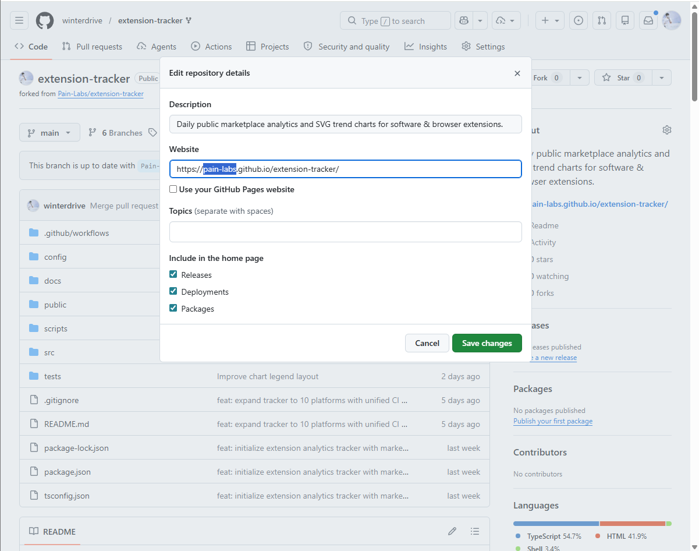
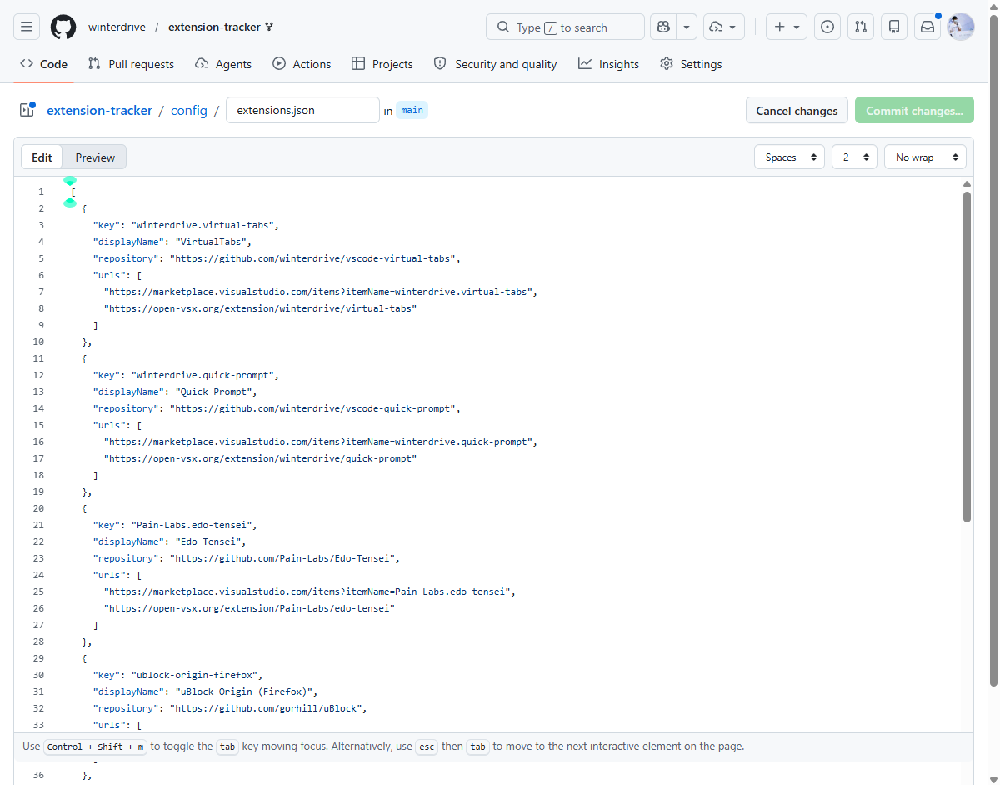
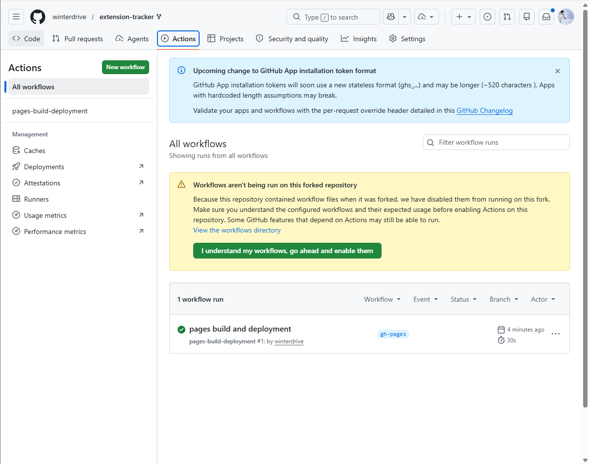
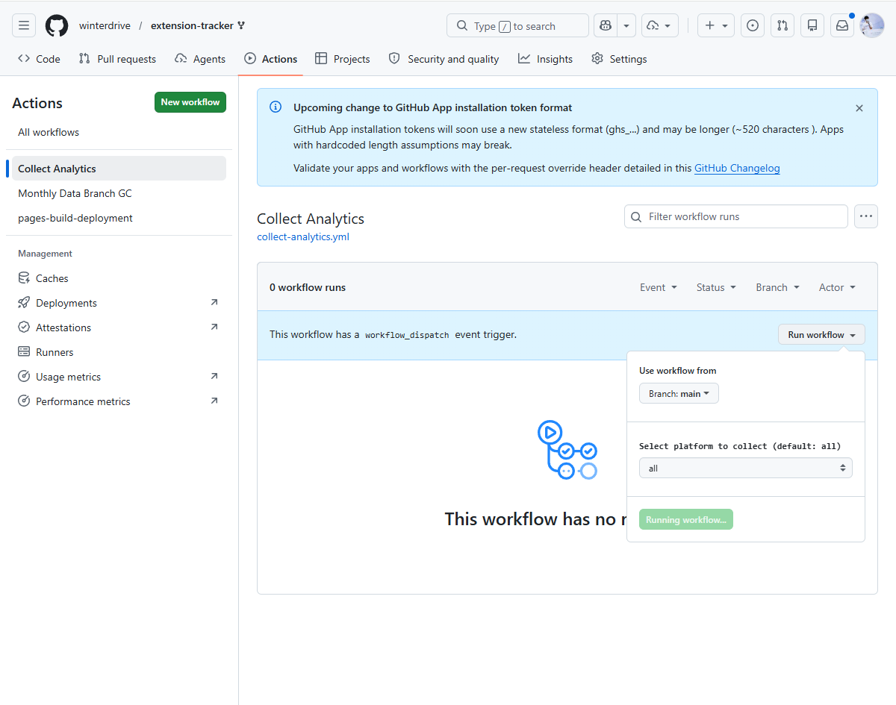
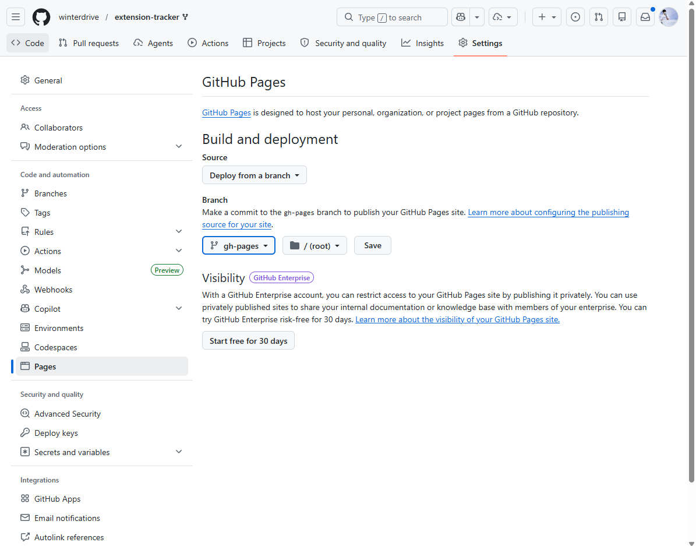

# extension-tracker

[English](../README.md) | [繁體中文](README.zh-TW.md) | [简体中文](README.zh-CN.md) | [日本語](README.ja.md) | [한국어](README.ko.md) | [Español](README.es.md)

Rastreador analítico diario del mercado público para extensiones.

`extension-tracker` recopila estadísticas públicas del mercado de extensiones, almacena una serie temporal en JSONL por producto/plataforma y genera un gráfico de tendencias en SVG por producto/plataforma. El repositorio está diseñado para ser bifurcado (forked): modifique `config/extensions.json`, habilite GitHub Actions y deje que los recolectores programados construyan su propio historial analítico público.

## Inicio rápido

1. Haz un fork de este repositorio. Luego actualiza la descripción del repositorio y la URL del sitio web para que apunten a tu propio GitHub Pages:

   

2. Edita [config/extensions.json](../config/extensions.json) con tus productos y las URL del mercado.

   

3. Ejecuta una comprobación local:

   ```bash
   npm install
   npm run build
   npm test
   npm run collect
   npm run query -- latest
   ```

4. Confirma (commit) tu configuración junto con los datos base generados en `output/`.

5. Habilita GitHub Actions en tu fork.

   

6. Ejecuta los flujos de trabajo de los proveedores manualmente una vez desde la pestaña Actions; luego, los horarios programados continuarán ejecutándose diariamente.

   

   > **Nota:** La recopilación de datos comienza desde esta primera ejecución. No se realiza relleno retroactivo de fechas anteriores a la recopilación inicial.

> **Sincronización con upstream:** Al obtener futuras actualizaciones de este repositorio, `config/extensions.json` está protegido por `.gitattributes` — Git siempre mantendrá la versión de tu fork y nunca la sobreescribirá con las entradas de demostración del upstream.

## Configuración

Cada entrada en [config/extensions.json](../config/extensions.json) describe un producto. Solo necesitas proporcionar una `key` estable y las URL del mercado público a rastrear.

```json
{
  "key": "publisher.product-name",
  "displayName": "Readable Name",
  "repository": "https://github.com/owner/repo",
  "urls": [
    "https://marketplace.visualstudio.com/items?itemName=publisher.extension-name",
    "https://open-vsx.org/extension/publisher/extension-name"
  ]
}
```

Campos:

| Campo | Propósito |
|---|---|
| `key` | Clave de producto estable utilizada para los nombres de los archivos de salida y las etiquetas de los gráficos. |
| `displayName` | (Opcional) Nombre legible por humanos para los mantenedores. |
| `repository` | (Opcional) URL del repositorio de código fuente. |
| `urls` | Páginas del mercado para recolectar. El recolector infiere los ID específicos del proveedor a partir de estas URL. |

Formatos de URL actualmente compatibles:

| Proveedor | Formato de URL |
|---|---|
| VS Code Marketplace | `https://marketplace.visualstudio.com/items?itemName=<publisher>.<name>` |
| Open VSX Registry | `https://open-vsx.org/extension/<namespace>/<name>` |

### Soporte planeado: Chrome Web Store

Para soportar Chrome Web Store en el futuro, la arquitectura requiere dos nuevas adiciones, manteniendo idéntico el archivo de configuración `config/extensions.json`:

1. **Analizador de URL (URL Parser)**: Reconocer la estructura `https://chromewebstore.google.com/detail/<name>/<extension_id>` para extraer el ID de la extensión.
2. **Recolector (Collector)**: Dado que Chrome Web Store no proporciona una API pública de JSON directa para las estadísticas, el recolector probablemente necesitará obtener la página HTML y analizar el número de usuarios, la calificación y la versión a partir de la estructura del DOM o los metadatos de los scripts incrustados.

### Otros mercados potenciales

La configuración basada en URL hace que sea trivial expandir el seguimiento a otros ecosistemas. Los posibles mercados futuros incluyen:

- **Chrome Web Store** (Extensiones de navegador)
- **Mozilla Add-ons (AMO)** (Extensiones de Firefox)
- **Microsoft Edge Add-ons** (Extensiones de Edge)
- **JetBrains Marketplace** (Plugins de IntelliJ, WebStorm, PyCharm)
- **Raycast Store** (Extensiones de Raycast)
- **npm Registry** (Estadísticas de descarga de bibliotecas o herramientas CLI)
- **Docker Hub** (Descargas de imágenes de contenedores)
- **GitHub Releases** (Recuentos de descargas para binarios precompilados)

## Productos rastreados (Tracked Products)

> Las entradas a continuación son **ejemplos de demostración** — un producto por cada proveedor compatible. Haz un fork de este repositorio y reemplázalos con tus propios productos para comenzar a rastrear.

| Clave de producto (Product key) | Repositorio (Repository) |
|---|---|
| `Pain-Labs.edo-tensei` | <https://github.com/Pain-Labs/Edo-Tensei> |
| `ublock-origin-firefox` | <https://github.com/gorhill/uBlock> |
| `ideavim-jetbrains` | <https://github.com/JetBrains/ideavim> |
| `typescript-npm` | <https://github.com/microsoft/TypeScript> |
| `ubuntu-docker` | <https://hub.docker.com/_/ubuntu> |
| `ripgrep-github` | <https://github.com/BurntSushi/ripgrep> |

## Comandos (Commands)

```bash
npm install
npm run build
npm test
npm run collect
npm run collect -- marketplace
npm run collect -- openvsx
npm run collect -- marketplace --shard 0/10 --concurrency 5
npm run query -- latest
npm run query -- trend winterdrive.virtual-tabs --days 30
npm run query -- releases winterdrive.virtual-tabs
npm run query -- export snapshots.csv
```

`npm run collect` recopila las URL de cada proveedor compatible en la configuración. Los flujos de trabajo específicos del proveedor usan el argumento de plataforma para que cada fuente de datos pueda fallar, reintentar o escalar de forma independiente.

## Archivos de salida (Outputs)

Todos los archivos generados se encuentran bajo el directorio `output/`:

```text
output/
  data/
    winterdrive.virtual-tabs-marketplace.jsonl
    winterdrive.virtual-tabs-openvsx.jsonl
  charts/
    winterdrive.virtual-tabs-marketplace.svg
    winterdrive.virtual-tabs-openvsx.svg
```

No hay un archivo agregado `snapshots.jsonl`. Si rastreas 1000 productos, la serie de cada producto/plataforma permanece aislada y se puede inspeccionar, regenerar o reparar independientemente.

### Cómo incrustar gráficos (GitHub Pages)

Para evitar la saturación (bloat) del repositorio Git con el tiempo, los gráficos SVG **no** se hacen commit en la rama `main`. En su lugar, GitHub Actions implementa automáticamente los gráficos generados en una rama dedicada `gh-pages`.

Para mostrar tus gráficos:

1. Asegúrate de que tu repositorio sea **Public (Público)**.
2. Ve a **Settings > Pages**.
3. En **Build and deployment**, selecciona **Deploy from a branch**.
4. Elige la rama **`gh-pages`** y `/ (root)`, luego haz clic en **Save**.

   

Una vez habilitado, puedes incrustar tus gráficos (que se actualizan automáticamente todos los días) en cualquier archivo Markdown usando la sintaxis estándar para imágenes:

```markdown

```

## Escalabilidad y Arquitectura (Scaling & Architecture)

Para configuraciones más grandes (ej. 1000 extensiones rastreadas durante 1000 días), este repositorio implementa varios mecanismos robustos de escalabilidad:

1. **Limitación de tasa de API (Rate Limiting)**: Aplica un límite estricto por host de 2 RPS usando un algoritmo de Token Bucket con backoff exponencial (retroceso) y jitter para prevenir prohibiciones `429 Too Many Requests`.
2. **Sharding matricial (Matrix Sharding)**: Los flujos de trabajo de GitHub Actions distribuyen la recolección de datos a través de trabajos matriciales paralelos (ej. 5 fragmentos/shards) para una ejecución más rápida.
3. **Agregación de artefactos (Artifact Aggregation)**: Los trabajos paralelos suben sus directorios aislados `output/` como artefactos. Un trabajo final dedicado de `commit` descarga todos los artefactos y los sube en un solo commit, eliminando las condiciones de carrera al hacer push en Git.
4. **Rama huérfana de datos (Data Orphan Branch)**: Para evitar que el repositorio de Git crezca descontroladamente con el tiempo, el historial de datos JSONL se guarda en una rama completamente separada llamada `data` en lugar de `main`.
5. **Recolección de basura del historial (History GC)**: Un flujo de trabajo mensual de mantenimiento (`gc-data-branch.yml`) agrupa (squash) automáticamente los commits de la rama `data` con una antigüedad superior a 180 días para mantener el repositorio extremadamente ligero.

También puedes ejecutar el sharding localmente:

```bash
npm run collect -- marketplace --shard 0/10
npm run collect -- marketplace --shard 1/10
```

El recolector limita la concurrencia de la API mediante `--concurrency` (predeterminado a `5`), de modo que una configuración grande no envíe todas las solicitudes a la vez.

## Flujos de trabajo (Workflows)

Los flujos de trabajo de los proveedores llevan el nombre de la fuente de datos. Comparten un grupo de concurrencia (concurrency group) para que las ejecuciones manuales o programadas formen una cola (queue) y no escriban gráficos/datos al mismo tiempo:

- `collect-vscode-marketplace.yml`: VS Code Marketplace, UTC 01:00 / CET 02:00
- `collect-open-vsx-registry.yml`: Open VSX Registry, UTC 01:10 / CET 02:10
